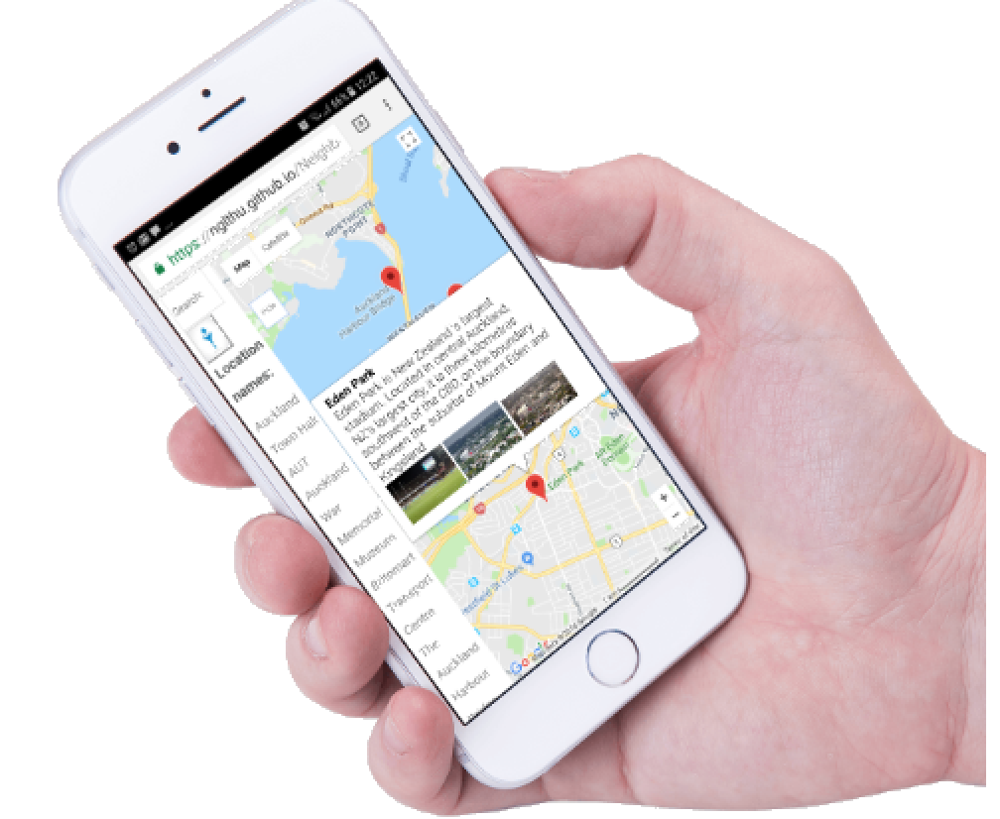

[![licence badge]][licence]
[![stars badge]][stars]
[![issues badge]][issues]

[licence badge]:https://img.shields.io/badge/license-MIT-blue.svg
[stars badge]:https://img.shields.io/github/stars/hey-red/Markdown.svg
[issues badge]:https://img.shields.io/github/issues/hey-red/Markdown.svg

[licence]:https://github.com/nglthu/Neighborhood/blob/master/License
[stars]:https://github.com/nglthu/Neighborhood/stargazers
[issues]:https://github.com/nglthu/Neighborhood/issues

## Introduction

A single-page web application, built using the Knockout framework, that displays a Google Map of an area and various points of interest. Users can search all included landmarks and, when selected, additional information about a landmark is presented from the Flickr API.

## Run the application

### Run online

1. Click the [link](https://nglthu.github.io/Neighborhood/) to run
2. There are a default list view of all supported destinations, click to see in detail without using search box.
3. Typing any destination in Search box and enter. 
4. Using search box to filter a destination in the list view based on the text typed in the search box.
5. Popup information will appear with detail information about a selected destination.
6. Click to see the place in details with a supported Flickr photos.

### Run offline

1. Download this source code 
2. Load the app using a localhost server

	* To set up local host server on Window: 

		Step 1: Click the Windows Start button and select "Control Panel." A window opens with a list of system options and utilities.
	
		Step 2:	Click the "Programs" link. Click "Turn Windows Features On or Off." A list of currently installed programs displays.
	
		Step 3: Check the box labeled "Internet Information Services." Click "OK." The IIS service installs on the computer.

	* Unzip this source code and Copy it to: C:\inetpub\wwwroot

	* Run as follow: http://127.0.0.1/Neighborhood/index.html

3.Follow steps from 2 to 6 in the Run online to experience with the app. 
